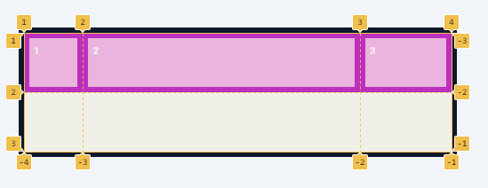
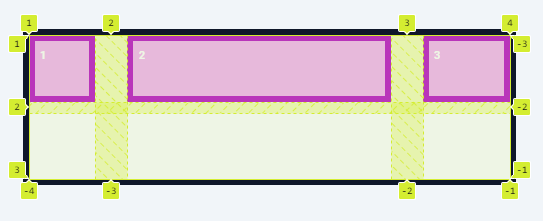

# CSS GRID
In web development, "Grid" usually refers to "CSS Grid," which is a powerful layout system in CSS (Cascading Style Sheets) used to design and structure web page layouts.
-  CSS Grid allows developers to create complex, two-dimensional layouts with rows and columns, providing a more flexible and intuitive approach compared to traditional layout methods like floats and positioning.

Here are some key properties of CSS Grid:

1. **display**: The `display` property with a value of `grid` is used to define a grid container.

    ```css
   .container {
    display: grid;
    }
    ```

2. **grid-template-columns** and **grid-template-rows**: These properties define the size and number of columns and rows in the grid.

    ```css
    .container {
         display: grid;
        grid-template-columns: 100px 100px 100px 100px 100px 100px;
        grid-template-rows: 100px 100px 100px 100px 100px 100px;
    }
    ```


3. **grid-column** and **grid-row**: These properties allow you to specify the placement of grid items within the grid.

    ```css
    .item-1{
    /* use these property when you specifically point the starting and ending */
    grid-row-start: 1;
    grid-row-end: 3;
    grid-column-start:1 ;
    grid-column-end:5 ; 
    
    /* shorthand property */
    grid-row: 1/3; 
    grid-column: 1/5;  
    }
    ```
    

4. **grid-column** and **grid-row**:
* The `grid-row` property with the value `span 2` in CSS Grid is used to specify how many grid rows an item should span. 
* When you set `grid-row: span 2;` for a grid item, it means that the item will occupy the current row and the next row in the grid. 
* This shorthand is often used to span grid items across multiple rows without explicitly specifying the end row number.

Here's an example:

```css
.item-1{
    grid-row: 1/3; 
    grid-column: 1/5;  
    }
.item-2{
    grid-row: span 2; 
    grid-column: span 2; 
    background-color: greenyellow;
}
```


5. **grid-area**: Defines a grid item's size and location within the grid.

    ```css
    .item-1{
    grid-row: 1 / 3;  
    grid-column: 1/7; 
    }

    .item-2{
    grid-row: span 2; 
    grid-column: span 2; 
    grid-area: 2 / 4 / 4 /6; 
    z-index: 1; 
    background-color: greenyellow; 
    }

    .item-3{
    /* grid-area:row-start col-start row-end col-end ; */
    grid-area: 3 / 1 / 7 / 7;
    /* both are same */
    grid-area: 3 / 1 / -1 / -1; 
    } 
    ```
    


## If you add another item in html despite not having any row left, Our grid added a new row for item-4. 


### When the items are added outside of a explicitly defined grid this is refered to as an implicit grid.

### Notice how item 4 is smaller than the others that because the implicit grid doesn't inherit the values that we set in the grid template rows and grid template columns properties 
### we can use grid-auto-rows  property on our container, what this does is set the size of the rows on any implicit grid that gets when i created set it to 100 pixels, now our implicit grid has a row of 100 pixels.

```css
.container{
    display: grid;
    grid-template-columns: 100px 100px 100px 100px 100px 100px;
    grid-template-rows: 100px 100px 100px 100px 100px 100px;
    /* to add the size of the impicit grid */
    grid-auto-rows: 100px;
}
```


 

### By default our implicit grid added a row but we can change this grid autoflow property and set it to column
### Now any implicit grid that gets created will be created as a column instead with column being the new default for our implicit grids we can use  grid auto columns to define the size of those columns and set it to 100px  

```css
.container{
    display: grid;
    grid-template-columns: 100px 100px 100px 100px 100px 100px;
    grid-template-rows: 100px 100px 100px 100px 100px 100px;
    /* to add the size of the impicit grid */
    grid-auto-rows: 100px;
        /* to change the flow of the grid cells */
    grid-auto-flow: column;
}

```


## We can also use the fractional unit like this 
```css
.container{
    display: grid;
   
    grid-template-columns: 1fr 3fr 1fr;

    /* we can mix the values like this */
    /* grid-template-columns: 100px 3fr 1fr; */

    grid-template-rows: 100px 100px;
}
```



## when we resize the page , some of the items are getting too thin. To set the minimum width  we can use the `minmax()` fuction inside the `grid-template-columns` and alsowe have `repeat()`function

```css 
.container{
      display: grid;
    /* two argument minumum size and maximum size  */
    /* resize and check that the cell will not shrink when it reaches 100px */
    grid-template-columns:100px  minmax(100px 3fr),1fr;
    grid-template-rows:repeat(2,100px);
}
```


6. **grid-gap** or **gap**: Specifies the size of the gaps between grid items.

    ```css
    .container {
    display: grid;
    grid-template-columns:100px  minmax(100px 3fr);
    grid-template-rows:repeat(2,100px);
    /* row and column*/
    grid-gap:1em 3em;
    }
    ```



7. **grid-template-areas**:
The grid-template-areas property in CSS Grid allows you to define named grid areas within the grid container. This property provides a convenient way to create complex layouts by visually representing the arrangement of grid items.

```css
.container{
    display:grid;
      grid-template-rows: 100px 300px 100px;
      grid-template-columns: 3fr 1fr;
      grid-template-areas: 
      'header header'
      'main aside'
      'footer footer'
      ;
}
.item-1{
        grid-area: header;
}
.item-2{
    grid-area: main;
}
.item-3{
    grid-area: aside;
}
.item-4{
    grid-area: footer;
}
```


# Align Property in grid

1. **justify-items**: This property aligns grid items along the inline (row) axis of the grid container. It affects all the grid items within the container. Possible values for `justify-items` are:

   - `start`: Aligns grid items to the start of the grid area within the grid container.
   - `end`: Aligns grid items to the end of the grid area within the grid container.
   - `center`: Centers grid items within the grid area horizontally.
   - `stretch`: Default value. Stretch grid items to fit the entire grid area.
   ```css
   .container {
       display: grid;
       justify-items: center; /* Centers grid items horizontally */
   }
   ```


2. **align-items**: This property aligns grid items along the block (column) axis of the grid container. It affects all the grid items within the container. Possible values for `align-items` are:

   - `start`: Aligns grid items to the start of the grid area within the grid container.
   - `end`: Aligns grid items to the end of the grid area within the grid container.
   - `center`: Centers grid items within the grid area vertically.
   - `stretch`: Default value. Stretch grid items to fit the entire grid area.

   ```css
   .container {
       display: grid;
       align-items: center; /* Centers grid items vertically */
   }
   ```

## justify-items:start and align-items:start


## justify-items:end and align-items:start


## justify-items:center and align-items:start


## `Make practice of this`


In addition to `align-items` and `justify-items`, CSS Grid Layout provides `align-self` and `justify-self` properties to individually control the alignment of specific grid items within their respective grid cells. These properties override the values set by `align-items` and `justify-items` for specific items.

1. **align-self**: This property aligns a single grid item along the block (column) axis of its grid cell. It allows you to override the `align-items` property for a specific grid item. Possible values for `align-self` are the same as for `align-items`.


2. **justify-self**: This property aligns a single grid item along the inline (row) axis of its grid cell. It allows you to override the `justify-items` property for a specific grid item. Possible values for `justify-self` are the same as for `justify-items`.

```css 
.container{
    display:grid;
      grid-template-rows: repear(4,100px);
      grid-template-columns: repeat(4,1fr);
      justify-items:start;
      align-items:end;
      
}
.item-1{
        justify-self:center;
        align-self:stretch;
}
```


# Justify-content and align-content

In CSS Grid Layout, `justify-content` and `align-content` are properties used to align grid tracks (rows for `align-content` and columns for `justify-content`) within their grid containers, when there is extra space available. These properties affect the entire grid container and not individual grid items.

1. **justify-content**: This property aligns the grid tracks (columns) along the inline (row) axis of the grid container. It controls the alignment of grid tracks when there is extra space in the grid container. Possible values for `justify-content` are:

   - `start`: Aligns the tracks to the start of the grid container.
   - `end`: Aligns the tracks to the end of the grid container.
   - `center`: Centers the tracks within the grid container.
   - `stretch`: Default value. Stretches the tracks to fill the grid container.
   - `space-around`: Distributes the tracks evenly with equal space around them.
   - `space-between`: Distributes the tracks evenly with equal space between them.
   - `space-evenly`: Distributes the tracks evenly with equal space around and between them.


2. **align-content**: This property aligns the grid tracks (rows) along the block (column) axis of the grid container. It controls the alignment of grid tracks when there is extra space in the grid container. Possible values for `align-content` are similar to those for `justify-content`.

```css
.container{
    display:grid;
    height:600px;
    grid-template-columns: repeat(2,100px);
    grid-template-rows: repeat(2,100px);
    justify-content:;
    align-items:;
/* <!-- by default it is start --> */

}
```
# Justify-content and align-content :start


# Justify-content and align-content :end


# Justify-content and align-content :center


# Justify-content and align-content :space-between


# Justify-content and align-content :space-evenly


# Justify-content and align-content :space-around


## To make it responsive use like this will wrap the content 
```css
.container{
    display:grid;
      /* for making responsive layout without  media queries */
  grid-template-rows: repeat(4,100px);
  /* grid-template-columns: repeat(4,minmax(100px,1fr)); */
  /* to make it wrap add auto-fit */
  grid-template-columns: repeat(auto-fit,minmax(100px,1fr));
}
```


