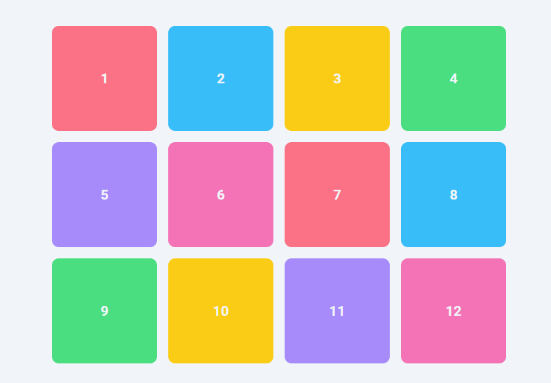
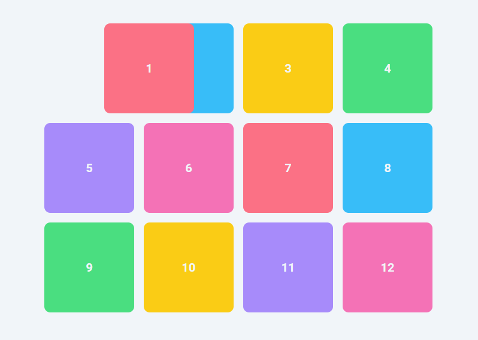

# Positioning Property - static and relative:
## static 
In CSS, `position: static;` is the default position value for an element.
*  Elements with `position: static;` are positioned according to the normal flow of the document, meaning they are not affected by the `top`, `bottom`, `left`, or `right` properties.

These properties have no effect on statically positioned elements.



```css
.item-1{
position: static;
  top: 100px;
  left: 100px;
}
```


## Relative
On the other hand, `position: relative;` allows you to position an element relative to its normal position in the document flow. When you set an element to `position: relative;`, you can use the `top`, `bottom`, `left`, and `right` properties to offset the element from its normal position without affecting the position of other elements. 



```css
.item-1{
position: relative;
  top: 100px;
  left: 100px;
}

```
