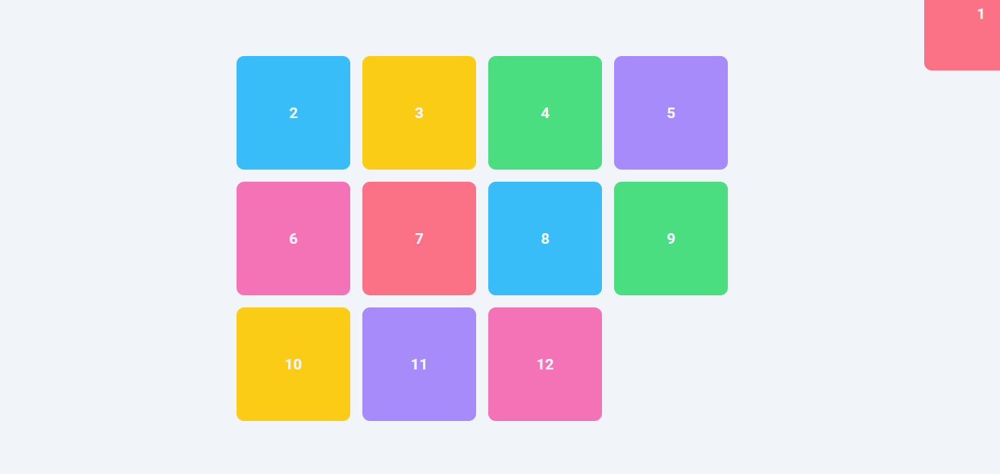
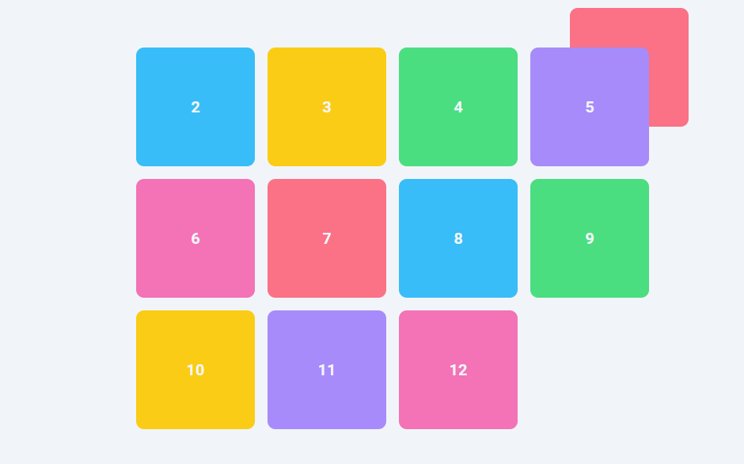

# Learn-CSS-Positioning
The `position` property in CSS controls how an element is positioned within its containing element. 
* The `absolute` value for the `position` property positions the element relative to its closest positioned ancestor(parent). 
* If there is no positioned ancestor, it is placed relative to the initial containing block (usually the `<html>` element or the viewport).

When an element is set to `position: absolute;`, it is taken out of the normal document flow, meaning it does not affect the position of other elements.
* It is then positioned based on the `top`, `bottom`, `left`, and `right` properties relative to its containing block. 

# Point to Notice
* whenever we define values on the `top`, `bottom`, `left`, and `right` that those position `item-1` relatie to the entire page, `-50px` on top and right corner of the entire page.

 <br>

```css
body {
  overflow-x: hidden; /* to avoid the  horizontal scroll bar*/
}

.item-1 {
  position: absolute;
  top: -50px;
  right: -50px;
  /* bottom: 0px; */
  /* left: 0px; */
}
```


* If you want the `item-1` to position itself relative to the its parent  then we need to give it position as relative, ant position will work except  static. 

 

```css
body {
  overflow-x: hidden;
}

.container {
  position: relative;
}
.item-1 {
  position: absolute;
  top: -50px;
  right: -50px;
  /* bottom: 0px; */
  /* left: 0px; */
  z-index: -1;
}

```


