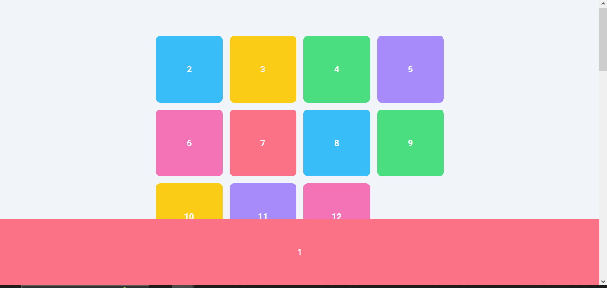

# Positioning Property - fixed and sticky
## Fixed
The `position` property in CSS also includes `position: fixed;`, which positions an element relative to the viewport, meaning it always stays in the same place even as the page is scrolled. This is useful for elements like headers or navigation bars that you want to remain visible at all times. 

Here's a quick comparison between `position: fixed;` and `position: static;`:

- `position: fixed;`: The element is removed from the normal document flow and is positioned relative to the viewportor (`<html>` element).
* It remains fixed in its position even when the page is scrolled.

```css
.item-1 {
  position: fixed;
 
}
```
<video width="520" height="400" controls>
<source src="./video/1.mp4" type="video/mp4">
</video>
<br><br>

`Then make some changes`

```css
.item-1 {
  position: fixed;
  bottom: 0px;
  left: 0px;
  border-radius: 0;
  width: 100%;
  z-index: 1;
} 
```


## Sticky
The `position: sticky;` CSS property is used to make an element "stick" to a specific position as the user scrolls the page.
* It's a hybrid of `position: relative;` and `position: fixed;`. 
* The element is treated as `position: relative;` initially, until it reaches a specified scroll position, then it is treated as `position: fixed;`.


```css
.item-5 {
  position: sticky;
  top: 50px;
}
```

<video width="520" height="400" controls>
<source src="./video/2.mp4" type="video/mp4">
</video>


